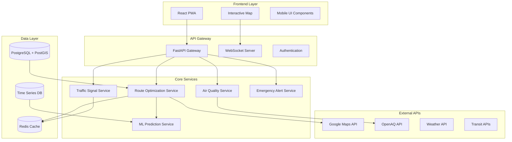

# SafeAir Navigator - Design Document

## Overview

SafeAir Navigator is a comprehensive smart navigation system that integrates traffic signal coordination, air quality monitoring, and multi-modal transportation optimization. The system uses a microservices architecture with real-time data processing capabilities to provide intelligent routing decisions that balance travel time, environmental impact, and user health considerations.

The platform consists of a React-based Progressive Web App (PWA) frontend, a FastAPI backend with machine learning capabilities, and integration with multiple external APIs for real-time data. The system is designed for scalability, supporting both individual users and city-wide traffic management.

## Architecture

### High-Level Architecture



### Technology Stack

**Frontend:**
- React 18 with TypeScript
- TailwindCSS for responsive design
- Leaflet/Mapbox GL JS for mapping
- Socket.IO client for real-time updates
- Service Workers for PWA capabilities
- Web Speech API for voice alerts

**Backend:**
- FastAPI with Python 3.9+
- SQLAlchemy ORM with PostgreSQL
- PostGIS for geospatial operations
- Redis for caching and session management
- Celery for background tasks
- WebSocket support for real-time communication

**Machine Learning:**
- Scikit-learn for traffic prediction models
- Pandas/NumPy for data processing
- TensorFlow Lite for mobile inference
- Historical data analysis for pattern recognition

**Infrastructure:**
- Docker containers for deployment
- Nginx for load balancing
- Prometheus/Grafana for monitoring
- CI/CD pipeline for automated deployment

## Components and Interfaces

### 1. Route Optimization Engine

**Purpose:** Core component that calculates optimal routes considering multiple factors including travel time, air quality, traffic signals, and user preferences.

**Key Algorithms:**
- Multi-objective optimization using weighted scoring
- Dijkstra's algorithm with custom edge weights
- Green wave synchronization calculations
- Real-time route adjustment based on conditions

**Interface:**
```python
class RouteOptimizer:
    def calculate_optimal_route(
        self,
        start_coords: Tuple[float, float],
        end_coords: Tuple[float, float],
        preferences: UserPreferences,
        real_time_data: Dict
    ) -> List[RouteOption]
    
    def calculate_green_wave_timing(
        self,
        signal_chain: List[TrafficSignal],
        average_speed: float
    ) -> Dict[str, int]
```

### 2. Air Quality Integration Service

**Purpose:** Manages real-time air quality data collection, processing, and integration into routing decisions.

**Data Sources:**
- OpenAQ API for real-time AQI data
- Historical pollution patterns
- Weather-adjusted predictions
- User-reported air quality observations

**Interface:**
```python
class AirQualityService:
    def get_route_aqi_data(
        self,
        route_coordinates: List[Tuple[float, float]]
    ) -> List[AQIReading]
    
    def calculate_health_impact(
        self,
        route: Route,
        user_profile: HealthProfile
    ) -> HealthImpactEstimate
```

### 3. Traffic Signal Coordination System

**Purpose:** Manages traffic signal timing predictions and green corridor optimization.

**Features:**
- Real-time signal state prediction
- Green wave calculation and simulation
- Integration with city traffic management systems
- Mock signal API for demonstration

**Interface:**
```python
class TrafficSignalService:
    def predict_signal_state(
        self,
        signal_id: str,
        arrival_time: datetime,
        current_speed: float
    ) -> SignalPrediction
    
    def optimize_corridor_timing(
        self,
        corridor: List[TrafficSignal]
    ) -> CorridorTiming
```

### 4. Emergency Alert and Community Reporting System

**Purpose:** Handles emergency broadcasts, community incident reporting, and automatic rerouting.

**Features:**
- Real-time emergency alert distribution
- Community-based incident reporting
- Automatic rerouting for affected users
- Integration with city emergency services

**Interface:**
```python
class EmergencyService:
    def broadcast_emergency_alert(
        self,
        alert: EmergencyAlert,
        affected_area: GeographicArea
    ) -> BroadcastResult
    
    def process_community_report(
        self,
        report: IncidentReport
    ) -> ValidationResult
```

### 5. Machine Learning Prediction Engine

**Purpose:** Provides predictive capabilities for traffic patterns, incidents, and optimal routing.

**Models:**
- Traffic pattern prediction using historical data
- Incident probability estimation
- Air quality forecasting
- Route optimization learning

**Interface:**
```python
class MLPredictionService:
    def predict_traffic_patterns(
        self,
        location: Coordinates,
        time_window: TimeWindow
    ) -> TrafficPrediction
    
    def predict_incident_probability(
        self,
        route_segment: RouteSegment,
        conditions: CurrentConditions
    ) -> IncidentProbability
```

## Data Models

### Core Entities

```python
# User and Session Management
class User(BaseModel):
    id: UUID
    session_id: str
    preferences: UserPreferences
    health_profile: Optional[HealthProfile]
    vehicle_type: VehicleType
    created_at: datetime

class UserPreferences(BaseModel):
    prioritize_time: float = 0.4
    prioritize_air_quality: float = 0.4
    prioritize_safety: float = 0.2
    voice_alerts_enabled: bool = True
    gamification_enabled: bool = True

class HealthProfile(BaseModel):
    age_group: str
    respiratory_conditions: List[str]
    pollution_sensitivity: float
    activity_level: str

# Geographic and Route Data
class Coordinates(BaseModel):
    latitude: float
    longitude: float
    altitude: Optional[float] = None

class Route(BaseModel):
    id: UUID
    start_coords: Coordinates
    end_coords: Coordinates
    waypoints: List[Coordinates]
    distance_km: float
    estimated_time_minutes: int
    average_aqi: int
    route_score: float
    created_at: datetime

class RouteSegment(BaseModel):
    start_point: Coordinates
    end_point: Coordinates
    distance_meters: float
    aqi_level: int
    traffic_signals: List[str]
    estimated_travel_time: int

# Traffic Signal Data
class TrafficSignal(BaseModel):
    id: str
    coordinates: Coordinates
    cycle_time_seconds: int
    current_state: SignalState
    next_change_time: datetime
    green_duration: int
    red_duration: int

class SignalPrediction(BaseModel):
    signal_id: str
    predicted_state: SignalState
    confidence: float
    time_to_arrival: int
    recommended_speed: Optional[float]

# Air Quality Data
class AQIReading(BaseModel):
    coordinates: Coordinates
    aqi_value: int
    pm25: float
    pm10: float
    no2: float
    o3: float
    timestamp: datetime
    source: str

class HealthImpactEstimate(BaseModel):
    route_id: UUID
    estimated_exposure_pm25: float
    health_risk_score: float
    recommended_precautions: List[str]
    comparison_to_baseline: float

# Emergency and Community Data
class EmergencyAlert(BaseModel):
    id: UUID
    alert_type: AlertType
    coordinates: Coordinates
    radius_km: float
    severity: SeverityLevel
    message: str
    is_active: bool
    created_at: datetime
    expires_at: Optional[datetime]

class IncidentReport(BaseModel):
    id: UUID
    reporter_session: str
    coordinates: Coordinates
    incident_type: IncidentType
    description: str
    severity: int
    verification_count: int
    created_at: datetime

# Analytics and Gamification
class TripMetrics(BaseModel):
    trip_id: UUID
    user_session: str
    route_id: UUID
    actual_travel_time: int
    time_saved_seconds: int
    fuel_saved_liters: float
    co2_avoided_kg: float
    pollution_exposure_avoided: float
    eco_score: int

class Achievement(BaseModel):
    user_session: str
    achievement_type: str
    points_earned: int
    milestone_reached: str
    earned_at: datetime
```

### Database Schema

```sql
-- Enhanced Traffic Signals Table
CREATE TABLE traffic_signals (
    id SERIAL PRIMARY KEY,
    signal_id VARCHAR(50) UNIQUE NOT NULL,
    latitude DECIMAL(10, 8) NOT NULL,
    longitude DECIMAL(11, 8) NOT NULL,
    cycle_time_seconds INTEGER NOT NULL,
    green_duration INTEGER NOT NULL,
    red_duration INTEGER NOT NULL,
    yellow_duration INTEGER DEFAULT 3,
    current_state VARCHAR(10),
    last_state_change TIMESTAMP,
    is_coordinated BOOLEAN DEFAULT FALSE,
    corridor_id VARCHAR(50),
    created_at TIMESTAMP DEFAULT NOW(),
    updated_at TIMESTAMP DEFAULT NOW()
);

-- Air Quality Readings Table
CREATE TABLE aqi_readings (
    id SERIAL PRIMARY KEY,
    latitude DECIMAL(10, 8) NOT NULL,
    longitude DECIMAL(11, 8) NOT NULL,
    aqi_value INTEGER NOT NULL,
    pm25 DECIMAL(6, 2),
    pm10 DECIMAL(6, 2),
    no2 DECIMAL(6, 2),
    o3 DECIMAL(6, 2),
    source VARCHAR(50),
    reading_time TIMESTAMP NOT NULL,
    created_at TIMESTAMP DEFAULT NOW()
);

-- Enhanced Routes Table
CREATE TABLE routes (
    id UUID PRIMARY KEY DEFAULT gen_random_uuid(),
    start_lat DECIMAL(10, 8) NOT NULL,
    start_lng DECIMAL(11, 8) NOT NULL,
    end_lat DECIMAL(10, 8) NOT NULL,
    end_lng DECIMAL(11, 8) NOT NULL,
    waypoints JSONB,
    distance_km DECIMAL(8, 3) NOT NULL,
    estimated_time_minutes INTEGER NOT NULL,
    average_aqi INTEGER,
    route_score DECIMAL(5, 2),
    route_type VARCHAR(20) DEFAULT 'optimal',
    created_at TIMESTAMP DEFAULT NOW()
);

-- User Sessions and Preferences
CREATE TABLE user_sessions (
    id UUID PRIMARY KEY DEFAULT gen_random_uuid(),
    session_id VARCHAR(100) UNIQUE NOT NULL,
    preferences JSONB,
    health_profile JSONB,
    vehicle_type VARCHAR(20) DEFAULT 'car',
    total_trips INTEGER DEFAULT 0,
    total_eco_score INTEGER DEFAULT 0,
    created_at TIMESTAMP DEFAULT NOW(),
    last_active TIMESTAMP DEFAULT NOW()
);

-- Trip Metrics and Analytics
CREATE TABLE trip_metrics (
    id UUID PRIMARY KEY DEFAULT gen_random_uuid(),
    trip_id UUID UNIQUE NOT NULL,
    user_session_id UUID REFERENCES user_sessions(id),
    route_id UUID REFERENCES routes(id),
    actual_travel_time INTEGER,
    time_saved_seconds INTEGER DEFAULT 0,
    fuel_saved_liters DECIMAL(6, 3) DEFAULT 0,
    co2_avoided_kg DECIMAL(6, 3) DEFAULT 0,
    pollution_exposure_avoided DECIMAL(6, 3) DEFAULT 0,
    eco_score INTEGER DEFAULT 0,
    completed_at TIMESTAMP DEFAULT NOW()
);

-- Emergency Alerts
CREATE TABLE emergency_alerts (
    id UUID PRIMARY KEY DEFAULT gen_random_uuid(),
    alert_type VARCHAR(50) NOT NULL,
    latitude DECIMAL(10, 8) NOT NULL,
    longitude DECIMAL(11, 8) NOT NULL,
    radius_km DECIMAL(6, 2) NOT NULL,
    severity INTEGER NOT NULL,
    message TEXT NOT NULL,
    is_active BOOLEAN DEFAULT TRUE,
    created_by VARCHAR(100),
    created_at TIMESTAMP DEFAULT NOW(),
    expires_at TIMESTAMP
);

-- Community Incident Reports
CREATE TABLE incident_reports (
    id UUID PRIMARY KEY DEFAULT gen_random_uuid(),
    reporter_session VARCHAR(100) NOT NULL,
    latitude DECIMAL(10, 8) NOT NULL,
    longitude DECIMAL(11, 8) NOT NULL,
    incident_type VARCHAR(50) NOT NULL,
    description TEXT,
    severity INTEGER DEFAULT 1,
    verification_count INTEGER DEFAULT 0,
    is_verified BOOLEAN DEFAULT FALSE,
    created_at TIMESTAMP DEFAULT NOW()
);

-- Achievements and Gamification
CREATE TABLE user_achievements (
    id UUID PRIMARY KEY DEFAULT gen_random_uuid(),
    user_session_id UUID REFERENCES user_sessions(id),
    achievement_type VARCHAR(50) NOT NULL,
    points_earned INTEGER NOT NULL,
    milestone_reached VARCHAR(100),
    earned_at TIMESTAMP DEFAULT NOW()
);

-- Parking Data (for Smart Parking feature)
CREATE TABLE parking_spaces (
    id SERIAL PRIMARY KEY,
    location_name VARCHAR(100) NOT NULL,
    latitude DECIMAL(10, 8) NOT NULL,
    longitude DECIMAL(11, 8) NOT NULL,
    total_spaces INTEGER NOT NULL,
    available_spaces INTEGER NOT NULL,
    hourly_rate DECIMAL(5, 2),
    is_ev_charging BOOLEAN DEFAULT FALSE,
    last_updated TIMESTAMP DEFAULT NOW()
);

-- Create spatial indexes for performance
CREATE INDEX idx_traffic_signals_location ON traffic_signals USING GIST (ST_Point(longitude, latitude));
CREATE INDEX idx_aqi_readings_location ON aqi_readings USING GIST (ST_Point(longitude, latitude));
CREATE INDEX idx_emergency_alerts_location ON emergency_alerts USING GIST (ST_Point(longitude, latitude));
CREATE INDEX idx_incident_reports_location ON incident_reports USING GIST (ST_Point(longitude, latitude));
CREATE INDEX idx_parking_spaces_location ON parking_spaces USING GIST (ST_Point(longitude, latitude));
```

## Error Handling

### Error Categories and Responses

**1. External API Failures:**
- Graceful degradation to cached data
- User notification of reduced accuracy
- Automatic retry mechanisms with exponential backoff
- Fallback to alternative data sources

**2. Real-time Data Unavailability:**
- Use historical patterns for predictions
- Clearly indicate data freshness to users
- Maintain core navigation functionality
- Queue updates for when connectivity returns

**3. Location Services Errors:**
- Request permission with clear explanations
- Provide manual location input options
- Use IP-based location as fallback
- Maintain functionality with reduced precision

**4. Performance Degradation:**
- Implement circuit breakers for failing services
- Load balancing and auto-scaling
- Prioritize critical features during high load
- User notification of service limitations

### Error Response Format

```python
class ErrorResponse(BaseModel):
    error_code: str
    message: str
    details: Optional[Dict]
    fallback_available: bool
    retry_after: Optional[int]
    user_action_required: Optional[str]

# Example error responses
EXTERNAL_API_ERROR = ErrorResponse(
    error_code="EXTERNAL_API_UNAVAILABLE",
    message="Air quality data temporarily unavailable",
    fallback_available=True,
    user_action_required="Using cached data from 10 minutes ago"
)

LOCATION_PERMISSION_ERROR = ErrorResponse(
    error_code="LOCATION_PERMISSION_DENIED",
    message="Location access required for navigation",
    fallback_available=False,
    user_action_required="Please enable location services"
)
```

## Testing Strategy

### Unit Testing
- **Backend Services:** Test each service component independently
- **Algorithm Testing:** Validate route optimization and signal prediction algorithms
- **Data Models:** Test data validation and transformation logic
- **API Endpoints:** Test all REST endpoints with various input scenarios

### Integration Testing
- **External API Integration:** Mock and test all third-party API connections
- **Database Operations:** Test complex queries and geospatial operations
- **Real-time Communication:** Test WebSocket connections and message handling
- **Cross-service Communication:** Test service-to-service interactions

### Performance Testing
- **Load Testing:** Simulate 1000+ concurrent users
- **Response Time Testing:** Ensure sub-2-second response times
- **Memory Usage:** Monitor memory consumption under load
- **Database Performance:** Test query performance with large datasets

### End-to-End Testing
- **User Journey Testing:** Complete navigation scenarios
- **Emergency Alert Testing:** Test alert propagation and rerouting
- **Multi-modal Integration:** Test combined transportation options
- **Offline Functionality:** Test cached data usage and sync

### Demo Scenarios for Hackathon

**Scenario 1: Green Corridor Navigation**
- Start navigation from Point A to Point B
- Show coordinated traffic signals with green wave timing
- Demonstrate voice alerts for upcoming signals
- Display time savings compared to uncoordinated route

**Scenario 2: Pollution-Aware Routing**
- Compare "Fast Route" vs "Clean Route" options
- Show AQI overlay on map with color coding
- Display health impact estimates for different routes
- Demonstrate route switching based on real-time AQI changes

**Scenario 3: Emergency Response**
- Simulate traffic incident or pollution spike
- Show emergency alert broadcast to all users
- Demonstrate automatic rerouting of affected drivers
- Show community reporting and verification process

**Scenario 4: Multi-modal Integration**
- Show combined car + public transit options
- Display EV routing with charging stations
- Demonstrate parking space finder integration
- Show weather-aware routing adjustments

**Scenario 5: Impact Dashboard**
- Display personal eco-score and achievements
- Show city-wide impact metrics
- Demonstrate gamification features
- Display carbon credit/token rewards

This design provides a comprehensive foundation for implementing all the required features while maintaining scalability, performance, and user experience standards suitable for both hackathon demonstration and real-world deployment.